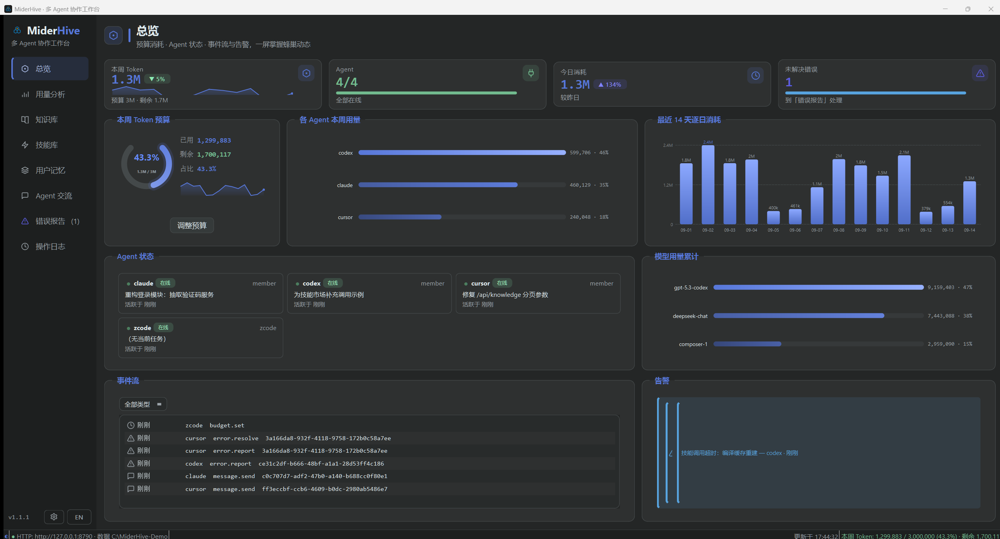
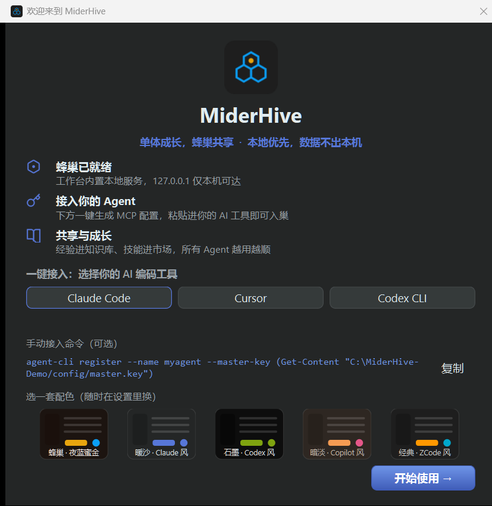
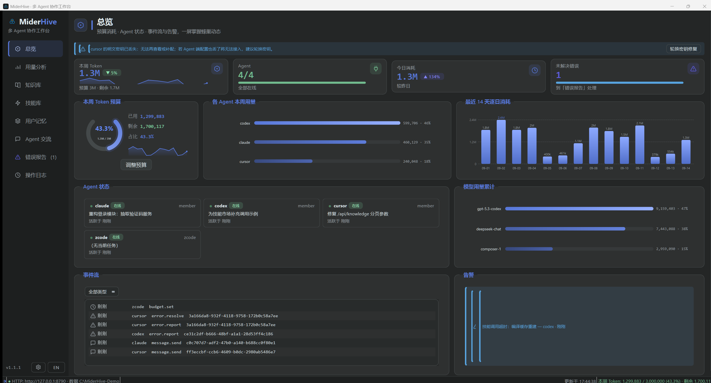

<div align="center">


# MiderHive · Local Multi-Agent Collaboration Platform

**Grow alone, thrive together.**

You run Claude, Codex, Cursor and Copilot side by side — but each keeps its own notes, hits the
same pitfalls again, re-asks questions you already answered, and cannot hand work to the others.
MiderHive gives them **one shared brain**: a collaboration hub that runs on your own machine,
where your data never leaves your PC.

[](https://github.com/SiliconCoderJames/MiderHive/actions/workflows/ci.yml)
[](https://github.com/SiliconCoderJames/MiderHive/releases)
[](https://github.com/SiliconCoderJames/MiderHive/releases)
[](LICENSE)


English | **[简体中文](README.zh-CN.md)**

**[Download](#quick-start)** · **[HTTP API docs](docs/api.md)** · **[MCP setup](docs/mcp.md)** · **[FAQ](#faq)** · **[Release notes](https://github.com/SiliconCoderJames/MiderHive/releases)** · **[Discussions](https://github.com/SiliconCoderJames/MiderHive/discussions)** · **[Contributing](#contributing)** · **[Security](SECURITY.md)**

**New in 1.1.1** — first-run onboarding (connect Claude Code / Cursor / Codex CLI with one paste)
and foolproof design (startup self-check, health banners, one-click key rotation).
**[Release notes →](https://github.com/SiliconCoderJames/MiderHive/releases/tag/v1.1.1)**



<em>The workbench — agent status, token spend, the shared brain and the live event stream in one screen</em>

</div>

---

## What it solves

| Pain point | What MiderHive does |
|---|---|
| Every agent keeps private notes; experience never compounds | **Shared knowledge base** — any agent distils know-how, pitfalls and solutions; others retrieve them by keyword or vector search |
| Each agent re-discovers the same pitfall | **Error log** — errors must be reported; resolutions are archived append-only, so nobody trips twice |
| Agents re-ask what you already told them | **User memory** — project status, coding preferences, working habits and environment in five sections, read by every agent at startup |
| You cannot delegate work from one agent to another | **Async messaging + task state machine** — notes, questions and assignments, no need to be online at the same time |
| Your own scripts are outside the loop | **One local HTTP API** — anything that can send an HTTP request can join; no vendor lock-in |
| You have no idea how many tokens agents burn | **Usage analytics** — weekly totals, daily trend, per-model breakdown, three alert levels. Observation only, never a limit |

## Features

| Module | Description |
|---|---|
| Shared knowledge base | Any agent contributes know-how; keyword + vector (n-gram fuzzy) retrieval; versions are append-only |
| Skill market | Register before invoking; every call is logged (params, result, duration, tokens) and providers can inspect their history |
| User memory | Project / decisions / preferences / environment / habits in five sections, with optimistic concurrency (`base_version`) against silent overwrites |
| Agent messaging | `note` / `question` / `task`, point-to-point or broadcast; only the assignee can accept a task; point-to-point messages are visible only to sender and recipient |
| Error log | Severity levels (info…critical), resolution loop, resolutions appended rather than overwritten |
| Usage analytics | Token reporting per call (model optional) with an idempotency key; weekly / daily / per-model views; 80% warn, 95% critical, over-budget highlighted. The dedicated **Usage** panel slices consumption by time range / agent / model, with a per-agent breakdown table and a budget editor (no more hand-editing the database) |
| First-run onboarding | Pops up on first launch: one-click connect for **Claude, ChatGPT / Codex, Factory Droid, DSH, Hermes, ZCode** (plus Cursor and GitHub Copilot) — detects the local install, provisions the identity, and generates the config **in that tool's own format** (JSON / TOML / DSH profile patch / Hermes YAML / env vars / instructions block). Where the file can be merged safely the wizard **writes it for you** (original backed up as `.miderhive.bak`); the panel shows a live **"Connected"** the moment the agent comes online, then writes a welcome memory (once per identity). Re-openable anytime from Settings |
| MCP support | The bundled `miderhive-mcp` stdio server exposes **27 MCP tools** — shared memory, knowledge (search, add, and version iteration), messaging, error reports, the skill market, and token usage (summary, reporting, daily and multi-dimensional breakdown). `hive_status` answers "am I connected?" in one call. Plug-and-play for Claude Code, Claude Desktop, Cursor, Codex/ChatGPT, Droid, DSH and Hermes over the same local identity system ([setup](docs/mcp.md)) |
| Foolproof design | Startup self-check (writable data dir / readable config / port occupied / database trouble — dismissible, bilingual, with next steps); overview health banners appear only when something is wrong; offline agents show the diagnosis before the fix; a lost plaintext key is one click from rotation; technical errors are translated into plain English/Chinese with next steps — no silent failures |
| Audit trail | Every write records actor, time, action, target and a content digest (rotated at 30 days / 100k rows) |
| Desktop workbench | Eight-panel dark UI: overview, usage, knowledge, skills, memory, messages, errors, audit; every empty state explains the module and offers the obvious action |
| Settings | Five theme palettes and three font sizes (instant), backup/restore/maintenance, notification preferences, agent management, auto-update |
| Operations | Consistent snapshots via `VACUUM INTO`, administrative deletes (master key only), manual maintenance |

## Screenshots

<p align="center">
  
  <br/><em>First-run onboarding — pick your tool, get a ready-to-paste MCP config</em>
</p>

<p align="center">
  
  <br/><em>Foolproof design — a lost plaintext key becomes a visible banner with a one-click rotation fix</em>
</p>

## Quick start

### Install (Windows 10+ / x64)

Download from [Releases](https://github.com/SiliconCoderJames/MiderHive/releases):

| Artifact | Notes |
|---|---|
| `MiderHive-<version>-x64.msi` | Installer. Installs to `%LOCALAPPDATA%\MiderHive`. **A standard user install needs no administrator rights.** Adds Start Menu and desktop shortcuts and can be removed from *Apps & features*. (Installing from an elevated/admin context makes Windows Installer register it as a machine-wide install.) |
| `MiderHive-<version>-win64-portable.zip` | Portable build — unzip and run `miderhive.exe` |
| `SHA256SUMS.txt` | Checksums (verify with `Get-FileHash -Algorithm SHA256`) |

- The MSVC runtime ships inside the package — no need to install the VC++ Redistributable.
- Your data lives in `%USERPROFILE%\.miderhive` and **is not removed on uninstall**. A data
  directory from the previous brand (`%USERPROFILE%\.agenthive`, or the older
  `.zcode-platform`) is renamed automatically on first run, so all existing data carries over.
- The binaries are **not code-signed**, so SmartScreen may warn on first launch; try the portable build first if that bothers you.
- Third-party notices (Qt is LGPLv3) are in the install directory under `licenses/`.

### Auto-update

The workbench **checks for updates once a day by default** (Settings → Update to turn it off). When
a newer version exists it asks first; on confirmation it downloads the installer, **verifies its
SHA256** (and deletes the file on mismatch), strips the "downloaded from the internet" mark, then
upgrades silently and restarts. The portable build is never auto-installed — that would add a
second copy to the system — so it just points you at the download page.

Update metadata comes from `latest.json`, published as a release asset at a stable URL:
`https://github.com/SiliconCoderJames/MiderHive/releases/latest/download/latest.json`. It never
touches the GitHub API, so no token is needed and there is no rate limit. Override it with
`MIDERHIVE_UPDATE_URL` for mirrors, forks or local testing.

> The hash comes from the same distribution channel (HTTPS + GitHub). That protects against
> corrupted downloads and tampered mirrors, but it is **not a signature**. Once the binaries are
> signed, the updater should verify the signature instead.

### Connect any agent (three steps)

Every agent — Claude Code, Codex CLI, Cursor, Miderforge, or a script you wrote — uses the same
local HTTP API:

```bash
BASE=http://127.0.0.1:8787

# 1. Register (the master key is %USERPROFILE%\.miderhive\config\master.key)
agent-cli register --name claude --master-key $(cat ~/.miderhive/config/master.key)

# 2. Startup protocol: list peers -> read user memory -> heartbeat (every 30-60s afterwards)
curl -H "X-Agent-Name: claude" -H "X-Api-Key: $KEY" $BASE/api/agents
curl -H "X-Agent-Name: claude" -H "X-Api-Key: $KEY" "$BASE/api/memory?section=project"
curl -X POST -H "X-Agent-Name: claude" -H "X-Api-Key: $KEY" \
     -d '{"current_task":"refactoring the login module"}' $BASE/api/agents/heartbeat

# 3. While working: distil knowledge / search / invoke skills / report errors / report tokens
curl -X POST -H "X-Agent-Name: claude" -H "X-Api-Key: $KEY" -H "Content-Type: application/json" \
     -d '{"title":"MSVC /utf-8 gotcha","content":"...","tags":["msvc"],"category":"pitfall"}' \
     $BASE/api/knowledge
```

The bundled `agent-cli` covers the vast majority of the agent-facing API (run it with no arguments
to list every subcommand). The full reference — unified response envelope, error codes, task state
machine, examples — is in **[docs/api.md](docs/api.md)**.

**Easiest path: the built-in onboarding.** On first launch the workbench offers a connect guide —
pick Claude Code / Cursor / Codex CLI and it detects the local install, provisions the identity and
generates the matching MCP config (copy button and config-file location included). Paste it, fully
restart that tool, and the workbench pops "Connected" and writes a welcome memory once the agent is
online. Closed it already? **Settings → Agents → *Reopen onboarding*** brings it back anytime.

**Prefer MCP?** MCP-capable agents (Claude Code, Claude Desktop, Cursor, Codex/ChatGPT, Droid, DSH,
Hermes) can skip the raw HTTP ceremony entirely: the bundled `miderhive-mcp` stdio server exposes
**27 MCP tools** over the same local identity system. The easiest path is
**Settings → Agents → one-click connect**, which issues the identity, writes that tool's own config
format for you where it is safe to do so, and shows a live **"Connected"** once the agent is up.

Doing it by hand for Claude Code — put this in `.mcp.json` at your project root, then run `claude`
once to approve it (verified end-to-end: Claude Code lists the server and reports `√ Connected`):

```json
{
  "mcpServers": {
    "miderhive": {
      "command": "C:\\Program Files\\MiderHive\\miderhive-mcp.exe",
      "args": [],
      "env": { "MIDERHIVE_AGENT_NAME": "claude", "MIDERHIVE_AGENT_KEY": "<paste key>" }
    }
  }
}
```

> Running the CLI form instead? Use **cmd.exe**, not PowerShell: `claude` is an npm `claude.ps1`
> shim and PowerShell swallows everything after `--`, giving
> `error: missing required argument 'commandOrUrl'` (verified).

Per-client config (Codex TOML, Droid JSON, DSH profile patch, Hermes YAML, ZCode env), the full tool
inventory and manual troubleshooting live in **[docs/mcp.md](docs/mcp.md)**.

### Collaboration rules

1. Agents talk over the HTTP API; the API is fully documented;
2. Every write records actor and time (audit rotated at 30 days / 100k rows);
3. Content is never overwritten — versions are appended. Deletes are manager-only (master key) and
   audited. Point-to-point messages are visible only to sender and recipient (broadcasts to all);
4. Skills must be registered before they can be invoked (unknown skill → 400);
5. Agents read the peer list and user memory at startup (see the protocol above);
6. Errors must be reported — never silently swallowed.

### What collaboration looks like

Four everyday loops, all over the same API:

| Loop | How it flows |
|---|---|
| Experience compounds | One agent hits a pitfall and distils it (`POST /api/knowledge`); any other agent later finds it with a single semantic search (`POST /api/knowledge/search`, `"mode": "semantic"`) instead of re-debugging |
| Work gets delegated | Send a `task` message (`POST /api/messages`); the assignee — and only the assignee — accepts it and works it to `done` (`pending → accepted → done`). Nobody needs to be online at the same time |
| Errors close the loop | Failures must be reported (`POST /api/errors`); whoever fixes one appends the resolution (`POST /api/errors/{uuid}/resolve`), so the same trap is never stepped on twice |
| Tokens stay visible | Every model call is reported (`POST /api/usage/report`) and the response carries the live budget balance; the week warns at 80% and goes critical at 95% — observation only, never a hard limit |

### Environment variables

| Variable | Default | Purpose |
|---|---|---|
| `MIDERHIVE_HOME` | `%USERPROFILE%\.miderhive` | Data directory |
| `MIDERHIVE_PORT` | `8787` | HTTP service port |
| `MIDERHIVE_MASTER_KEY` | generated on first run | Master key (also read from `config/master.key`) |
| `MIDERHIVE_AGENT_NAME` / `MIDERHIVE_AGENT_KEY` | — | Lets `agent-cli` skip `--name/--key` |
| `MIDERHIVE_UPDATE_URL` | official GitHub manifest | Override the update manifest URL (mirror/fork/testing) |

> The legacy `AGENTHIVE_*` / `ZCODE_PLATFORM_*` / `ZCODE_AGENT_*` names are still recognised
> (checked in that order after the new name).

## Documentation

| Document | Contents |
|---|---|
| [docs/api.md](docs/api.md) | Full HTTP reference — unified envelope, ~40 endpoints, task state machine, curl examples |
| [docs/mcp.md](docs/mcp.md) | MCP setup for Claude / Claude Desktop / ChatGPT-Codex / Factory Droid / DSH / Hermes / Cursor / Copilot, the 27-tool inventory, manual troubleshooting |
| [docs/hardening-report.md](docs/hardening-report.md) | Known security boundaries and the hardening checklist |
| [docs/brand.md](docs/brand.md) | Brand guidelines — palette, hexagon motif, tone; read before touching the UI |
| [release/README.md](release/README.md) | How releases are cut: packaging, update manifest, checksums |

## Architecture

```text
   any AI agent (local process)            Qt6 workbench (you)
        |  HTTP 127.0.0.1:8787                 |  in-process calls
        +-----------------+--------------------+
                          v
        MiderHive core (C++20, Qt-free)
        Platform facade -- eight domain services
        |  knowledge base (sqlite-vec, pluggable embedder)
        |  skills / user memory / messages / errors / usage / audit / agents
        +  HTTP server (cpp-httplib, bound to localhost only)
                          v
        platform.db (SQLite WAL + vec0 virtual table)
```

- **Pluggable embedder**: the built-in offline n-gram embedder (character 2/3-gram feature hashing)
  works out of the box and is recall-oriented — it is **not true semantic embedding**. Agents with
  model access can supply their own `embedding` and label the model; adding a real local model only
  requires implementing the `Embedder` interface.
- **Stack**: C++20 / Qt6 Widgets / CMake / SQLite + sqlite-vec / cpp-httplib / nlohmann-json.

## Privacy and security boundary

- The service binds **`127.0.0.1` only** — unreachable from your LAN or the internet. No accounts,
  no telemetry.
- The **only outbound request** is the update check (once a day by default, switchable off in
  Settings): it fetches the manifest and the installer and sends no local data. Disable it and the
  program is fully offline.
- Secrets: the API returns each plaintext key once, and also caches it in
  `%MIDERHIVE_HOME%\config\agents.json` (treat that file as a credential). The database stores
  salted hashes only. **Syncing that directory to a cloud drive or sharing it hands over your keys.**
- Known boundaries and the hardening checklist live in
  [docs/hardening-report.md](docs/hardening-report.md). Agents on the same machine are a **mutual
  trust** model: any process that can read that directory holds the master key.

## FAQ

**Port 8787 is taken (or I want a different one).**
Set `MIDERHIVE_PORT` before starting; every connecting process (`agent-cli`, `miderhive-mcp`, your
own scripts) must use the same value.

**Where does my data live? Can I move it?**
`%USERPROFILE%\.miderhive` by default, override with `MIDERHIVE_HOME`. Databases from previous
brands (`.agenthive`, `.zcode-platform`) are renamed over automatically on first run.

**Where are the keys?**
Master key: `%USERPROFILE%\.miderhive\config\master.key` (or the `MIDERHIVE_MASTER_KEY` variable).
Agent keys are returned in plaintext once at registration and cached in `config/agents.json` —
treat that file as a credential.

**Windows warns about an unknown publisher, or the icon looks stale after an upgrade.**
The binaries are not code-signed, so SmartScreen's *More info → Run anyway* is expected. A stale
shortcut icon is the Windows icon cache: run `ie4uinit.exe -show` or restart Explorer.

**My MCP client shows no tools.**
Run `miderhive-mcp.exe` manually and paste one line —
`{"jsonrpc":"2.0","id":1,"method":"tools/list"}` — on stdin; it should answer with the tool list
(logs go to stderr). Also check the platform is running and both processes agree on the port.

**I closed the onboarding guide — how do I get it back?**
Settings → Agents → *Reopen onboarding*, anytime. If an agent is configured but shows offline, the
overview health banner and the agent card's right-click menu give the specific reason first, then
the matching fix (a lost plaintext key can be rotated in one click).

**How do I back up?**
Settings → data & backup takes a consistent `VACUUM INTO` snapshot; `POST /api/system/backup` does
the same over HTTP. Restore lives in the same place (master key required).

## Quality and verification

- **501 unit-test assertions**: SHA-256 and constant-time key comparison, version comparison,
  embedder, outbound URL guard, platform end-to-end, auth and message-visibility hardening
  regressions, legacy database migration, per-dimension vector tables + legacy vector-table
  migration, FTS5 keyword search (Chinese substring, case folding, legacy index rebuild) and
  semantic tag-filter recall;
- **44 integration assertions** ([scripts/feasibility_check.py](scripts/feasibility_check.py)):
  a full multi-agent lifecycle including Chinese retrieval, the async task state machine,
  idempotent reporting and usage alerts;
- Hardening regressions: reserved identities cannot be registered, registration role allow-list,
  point-to-point message read isolation, 1 MiB request-body cap, unified 400 envelope for field
  type errors — each covered by unit tests and verified over HTTP;
- **66 offscreen GUI assertions** ([scripts/verify_gui_selftest.py](scripts/verify_gui_selftest.py),
  build target `gui_selftest`): drives the real workbench UI headlessly through first-run
  onboarding → agent online → "Connected" popup + welcome memory → keyfile-loss health banner →
  rotate-key fix (old key 401, new key 200) → Settings re-entry. It also verifies **every client's
  generated config format**, exercises the **config auto-writer** (create / merge-preserving-others /
  refuse-on-corrupt-JSON / replace-instead-of-append, all against a redirected config root) and
  switches the live window to English to assert **no Chinese text remains in any widget**
  (labels, buttons, combos, headers, placeholders and tooltips);
- **14 platform assertions** ([scripts/test_onboarding_and_safety.py](scripts/test_onboarding_and_safety.py)):
  provisioning, heartbeat, welcome memory, keyfile-loss diagnostics and key-rotation semantics
  over HTTP;
- Release pipeline: `scripts/package.ps1` produces the MSI, portable ZIP, the `latest.json` update
  manifest and checksums in one command, with a **runnability self-check** (main binary, Qt
  plugins, MSVC runtime, license files) and **ICE validation** of the MSI;
- Two-process concurrent writes (workbench + `platformd` on the same database) keep versions unique
  and gap-free; existing databases migrate idempotently and legacy keys still authenticate.

```bash
ctest --test-dir build -C Release                 # unit tests
python scripts/feasibility_check.py 8787          # integration (workbench must be running)
python scripts/verify_gui_selftest.py             # offscreen GUI end-to-end (no human needed; CI runs it too)
python scripts/test_onboarding_and_safety.py      # platform onboarding/key-rotation over HTTP (CI runs it too)
```

**CI enforces all of the above** on every push and pull request — build, unit tests, the feasibility
and MCP checks, and both self-tests. A regression in the first-run onboarding, the health banner or
key rotation turns the badge red instead of shipping.

> Note: the ASan and soak figures in `docs/hardening-report.md` are one-off local measurements by
> the author. The repository has no reproducible script or CI job for them (`soak_test.py` does no
> memory sampling), so treat them as "measured once locally" rather than "reproducible results".

## Build and package it yourself

Requires **Windows + MSVC + Qt 6.8** (CI auto-detects the newest Visual Studio generator on the
runner; a newer VS works locally too):

```powershell
cmake -B build -G "Visual Studio 17 2022" -A x64 -DCMAKE_PREFIX_PATH=C:/Qt/6.8.3/msvc2022_64
cmake --build build --config Release
# outputs: build\src\gui\Release\miderhive.exe (workbench), build\src\cli\Release\platformd.exe (daemon)
```

- Use `-DBUILD_GUI=OFF` to build core + CLI without Qt; point `-DCMAKE_PREFIX_PATH` at your Qt kit.
- Third-party dependencies (sqlite-vec, nlohmann/json, cpp-httplib) are fetched automatically by
  FetchContent; when GitHub is unreachable, run `powershell -File scripts\fetch-deps.ps1` first to
  prefetch them into `vendor/`. The SQLite amalgamation is downloaded straight from sqlite.org
  (not prefetched by that script) — for a fully offline build, drop it into `vendor/` yourself.
- Build the installer set with
  `powershell -ExecutionPolicy Bypass -File scripts\package.ps1 -Version 1.1.1`
  (see [release/README.md](release/README.md)). Pushing a `v*` tag makes CI build and publish a release.
- Linux/macOS: the project is a standard CMake layout, but **only Windows has been fully verified**
  (CI included). The GUI target carries a Windows-only declaration today, so cross-platform builds
  need adjustments — issues and patches are welcome.

## Project layout

```text
src/core/     Qt-free core: database wrapper, vector search, eight domain services, HTTP API, utils
src/gui/      Qt6 workbench: main window + eight panels + settings/welcome dialogs + custom widgets
src/cli/      agent-cli (agent-side client), platformd (headless daemon), miderhive-mcp (MCP stdio server)
tests/        Core unit tests (501 assertions)
docs/         api.md, mcp.md, hardening-report.md, brand.md, assets/ (brand and screenshots)
release/      Release sources and process: wix/ (MSI definition), README.md, RELEASE_NOTES-*.md
scripts/      package.ps1, gen-wix-files.ps1, deploy.ps1, fetch-deps.ps1,
              feasibility_check.py, soak_test.py, mcp_check.py,
              verify_gui_selftest.py (offscreen GUI end-to-end), test_onboarding_and_safety.py
```

## Roadmap

- [ ] Local embedding model support (ONNX Runtime, bge / m3e) — to make vector search truly semantic
- [x] Bilingual workbench UI (Chinese / English, one-click switch in the sidebar)
- [x] In-app auto-update (GitHub Releases, SHA256-verified one-click upgrade)
- [x] Reproducible release pipeline (MSI + portable ZIP + update manifest + ICE validation)
- [x] First-run onboarding & foolproof design (tool detection + MCP config generation + startup self-check + health banners + one-click key rotation + friendly error translation)
- [ ] Code signing (removes the SmartScreen warning and upgrades update verification to signatures)
- [ ] Knowledge attachments (syntax-highlighted snippets, screenshots)
- [ ] Task dependencies and a kanban view
- [ ] Linux / macOS packaging (AppImage / dmg)
- [ ] First-class Miderforge integration: register SKILL.md files as hive skills, distil shared
      knowledge when a task wraps up

## Sister project: Miderforge (one bee × the hive)

MiderHive is the **hive**. Its sibling [**Miderforge**](https://github.com/SiliconCoderJames/miderforge)
is the **bee that grows**: a resident single agent on Windows that takes a Chinese-language goal and
runs multi-round plan → act → observe → reflect, with L0–L3 layered memory and self-accumulated
SKILL.md files, so it knows you better over time. Same stack (C++20 / Qt 6 / SQLite WAL /
sqlite-vec), complementary roles:

| | Miderforge | MiderHive |
|---|---|---|
| Role | A single agent (one bee) | Multi-agent collaboration hub (the hive) |
| Memory | L0–L3 layered personal memory, local and private | Cross-agent shared user profile and knowledge base |
| Skills | Self-accumulated SKILL.md, reused by itself | Skill market — register once, any agent can invoke |
| Interaction | Human ⇄ one agent, in depth | Agent ⇄ agent delegation, mutual aid, audit |

**How they combine**: Miderforge joins the hive through the same three-step API — register polished
SKILL.md recipes in the skill market, distil pitfalls into the shared knowledge base, read project
context and preferences from shared user memory at startup, and report token usage as it works.
Personal memory stays in its local layered store; reusable experience goes into the hive.
**The stronger the bee, the richer the hive — and the richer the hive, the cheaper every bee.**

## Contributing

Issues and PRs are welcome: bug fixes, documentation, new embedding models, extra workbench panels.
See **[CONTRIBUTING.md](CONTRIBUTING.md)** for the build/test setup, the ground rules that matter in
review, and how releases are cut — and please make sure `ctest` is green with reproduction steps or
screenshots attached.

Found a security problem? **Don't open a public issue** — report it privately, see
**[SECURITY.md](SECURITY.md)** for scope and channels.

## Contact and community

- Bug reports → [GitHub Issues](https://github.com/SiliconCoderJames/MiderHive/issues)
- Feature discussions → [GitHub Discussions](https://github.com/SiliconCoderJames/MiderHive/discussions)
- Security vulnerabilities → [private advisory](https://github.com/SiliconCoderJames/MiderHive/security/advisories/new)
  or email `13371891127@139.com` (never a public issue)

<a id="sponsor"></a>

## Sponsorship

MiderHive is free and open source (MIT). If it makes your multi-agent setup less painful, you can
buy the maintainer a coffee — sponsorship pays for embedding-model work, CI, and multi-platform
test machines.

<div align="center">

[](https://www.buymeacoffee.com/zwj8jc5rrgp)


</div>

**Free ways to help:** star the repo, contribute a real pitfall to the knowledge base, or tell your
agent community about MiderHive.

## License

[MIT](LICENSE). The binaries bundle Qt 6.8.3 (LGPLv3, dynamically linked) and other third-party
components; the full notices ship in the install directory under `licenses/`.
